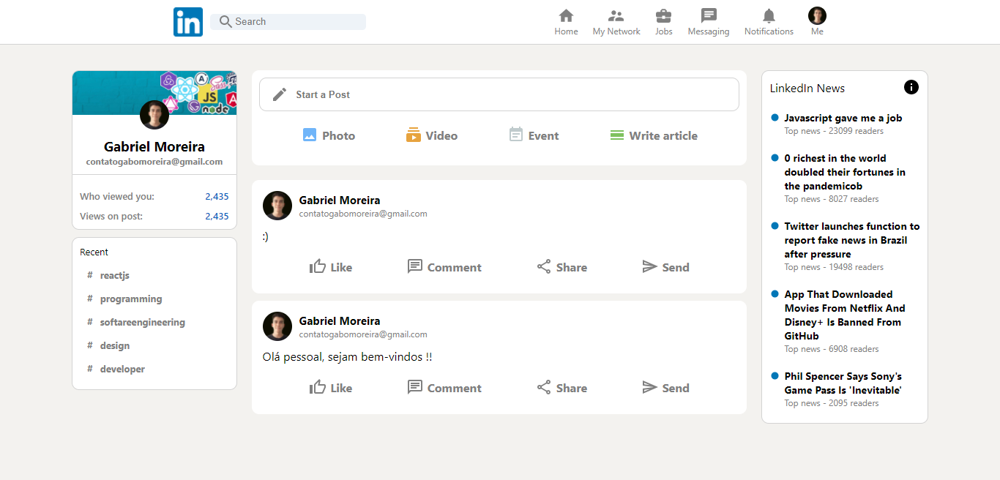

# LinkedIn Clone

> Aplicação para o envio de postagens.

## ☕ Usando LinkedIn Clone

Para usar LinkedIn Clone, clique no link abaixo:

[![Link]](https://linkedin-clone-6a323.web.app/)

## 💻 Tecnologias

As tecnologias utilizadas para construir o LinkedIn Clone foram:

- React
- JavaScript
- Redux
- Material UI
- Firebase

## 🤝 Colaborador

Agradecemos à seguinte pessoa que contribuíu para este projeto:

<table>
  <tr>
    <td align="center">
      <a href="https://github.com/gabomoreira">
         
        
          <b>Gabriel Moreira</b>
        
      </a>
    </td>
  </tr>
</table>
